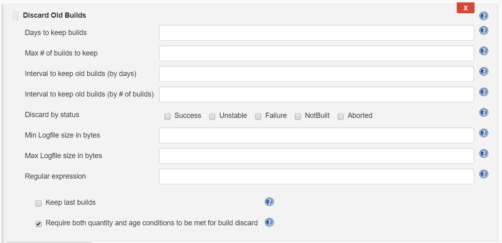
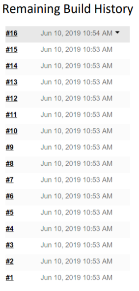
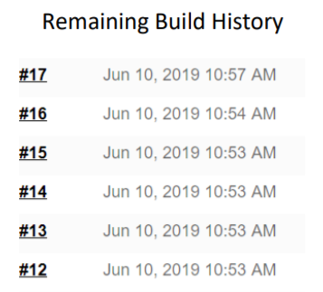
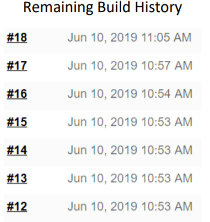
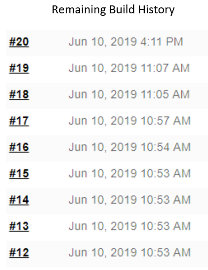

Discard Old Build plugin
===========================

Discard Old Build is a Jenkins plugin that allows for setting build discard conditions with greater specificity
than is available in the Jenkin's core function. It is recommended that users carefully test plugin configurations
before implementing in important projects to avoid any plugin misconfigurations producing unwanted build history
discards.

The plugin functions as a post-build action with the below interface used for configuration:

The configuration settings allow for builds to be discarded based on age, quantity, intervals of these properties, 
status, logfile size and expressions parsed from logfiles. **Features are described in detail in the Jelly help 
documentation accessible through the top-right of the interface.**

Discard conditions are executed in the order shown in the UI. The only exception to this is when using 
*Require both quantity and age conditions to be met for build discard*. Example case uses of this particular feature are
 given below. Case examples were performed using all default plugin settings, with the aforementioned feature enabled
 with max days and max build quantity values set.

***Case Example #1:*** 15 builds are present, none of which exceed an age limit of 10 days, with a max build hold of 6.

*Outcome:* No builds are cleared.

***Case Example #2:*** 16 builds exceeding an age limit of 0 days are present, with a max build hold of 6.

*Outcome:* The 6 most recent builds are kept.

***Case Example #3:*** 6 builds exceeding an age limit of 0 days are present, with a max build hold of 7.

*Outcome:* No builds are deleted.

***Case Example #4:*** 0 builds exceeding an age limit of 10 days are present, with a max build hold of 0.

*Outcome:* No builds are deleted.

